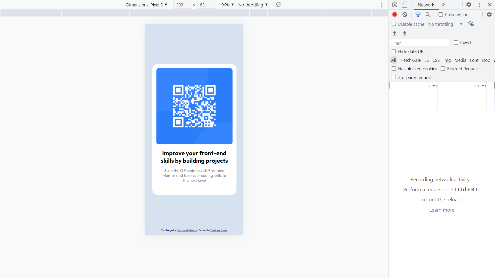

# Frontend Mentor - QR code component solution

This is a solution to the [QR code component challenge on Frontend Mentor](https://www.frontendmentor.io/solutions/qr-code-component-htmlcss-Bkws3ZtQq). Frontend Mentor challenges help you improve your coding skills by building realistic projects. 

## Table of contents
  - [Screenshot](#screenshot)
  - [Links](#links)
  - [Built with](#built-with)
  - [Author](#author)

### Screenshot

### Links

- Solution URL: [solution here](https://www.frontendmentor.io/solutions/qr-code-component-htmlcss-Bkws3ZtQq)
- Live Site URL: [live site here](https://desi-j.github.io/qr-code-component/)

### Built with

- Semantic HTML5 markup
- CSS custom properties
- CSS Positioning
- Mobile-first workflow

## Author

- Website - [github](https://desi-j.github.io/qr-code-component/)
- Frontend Mentor - [@Desi-J](https://www.frontendmentor.io/profile/Desi-J)

